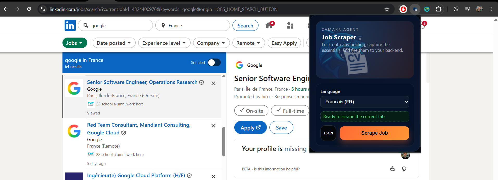

## CVMakr Job Scraper (Chrome Extension)

This extension completes the CVMakr workflow by automating the repetitive part of sourcing job descriptions and URLs. Instead of copy‑pasting content for every application, you now have a single “Scrape Job” button that collects the page data, lets you pick the language (`fr` by default), and POSTs the payload straight to your local CVMakr backend.

### Features
- Manifest V3 Chrome extension written in vanilla JS/HTML/CSS
- Dark “sharky” popup UI with a language toggle
- Injected content script that scrapes job title/description + URL (special handling for LinkedIn and Welcome to the Jungle)
- Background service worker that POSTs the extracted data to `http://localhost:8000/jobs` (same payload you previously typed into `curl`)

### Getting Started
1. Build/run your CVMakr backend locally so `http://localhost:8000/jobs` accepts POST requests.
2. In Chrome, open `chrome://extensions`, enable **Developer mode**, then click **Load unpacked** and select this `CVMakr_Extension` folder.
3. Open a job listing (LinkedIn, Welcome to the Jungle, or any other site), open the extension popup, choose FR/EN, and hit **Scrape Job**.
4. The popup shows progress (“Scraping…”, “Sending…”). Once the backend replies with 200 OK, you’ll see “Job sent to backend successfully!”.

### Folder Structure Highlights
- `manifest.json` — MV3 configuration with permissions, icons, and popup/background wiring.
- `popup/` — HTML/CSS/JS for the popup UI and its button/selector logic.
- `scripts/scrapeJob.js` — The injected scraper (self-contained so MV3 can serialize it).
- `background.js` — Service worker that validates the payload and uses `fetch` to call the backend.
- `assets/` — The icon placeholders referenced by the manifest (drop your real PNGs here with the same filenames).

### Notes & Extensibility
- Additional job boards can be supported by extending the selector profiles in `scripts/scrapeJob.js`.
- If/when the backend endpoint changes, update `API_ENDPOINT` in `background.js`.
- To revert to JSON downloads (early MVP behavior), reintroduce the `downloads` permission and file saving logic in the service worker.

This repository is ready to push to GitHub; just remember to swap in the final logo assets before publishing.
